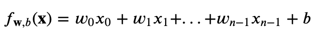
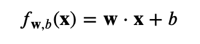
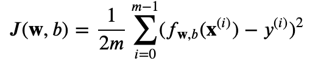
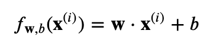
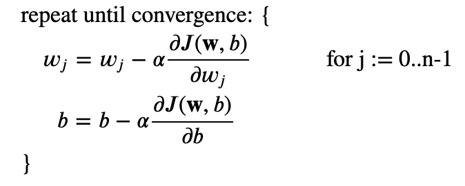
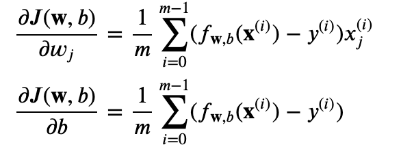
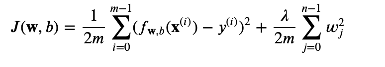
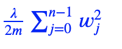
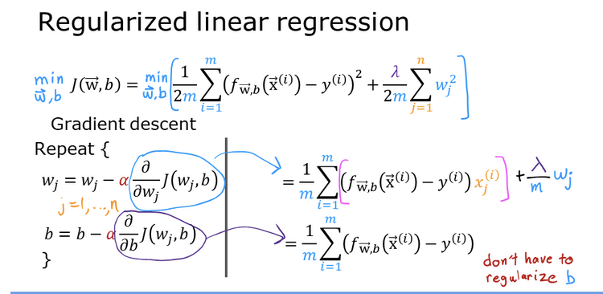

# Multiple variable Linear Regression
- [Model Function](#model-function)
- [Cost Function](#cost-function)
- [Gradient Descent](#gradient-descent)
- [Regularization](#regularization)

## Model Function
The model's prediction with multiple variables is given by the linear model:

or, in vector notation

## Cost Function
The equation for the cost function with multiple variables 𝐽(𝐰,𝑏) is:

where 

## Gradient Descent
Gradient descent for multiple variables:

where, n is the number of features, parameters 𝑤𝑗, 𝑏, are updated simultaneously and where 

## Regularization
Regularization serves the purpose to limit model parameters wj in order to avoid or at least minimize overfitting.

The equation for the cost function regularized linear regression is:

where 

The difference is the regularization term

Including this term encourages gradient descent to minimize the size of the parameters. Note, in this example, the parameter 𝑏 is not regularized. This is standard practice.

Here is how Linear regression cost function and gradient descent equations gets modified when regularization is added.

***************************************************************************************************************************************************
***** Credit to Andrew Ng (definitions and formulas are taken from his course **Supervised Machine Learning: Regression and Classification**) *****
***************************************************************************************************************************************************