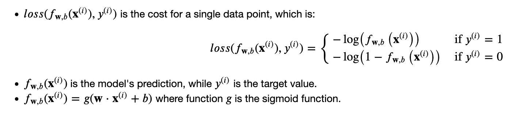

# Classification and Logistic Regression
- [Model Function](#model-function)
- [Loss and Cost Functions](#loss-and-cost-functions)
- [Gradient Descent](#gradient-descent)
- [Regularization](#regularization)

## Model Function
The predictions of a classification model must be between 0 and 1 since the output variable y is either 0 or 1.

This approach utilizes the logistic (or sigmoid) function to transform a linear combination of input features into a probability value ranging between 0 and 1.

This probability indicates the likelihood that a given input corresponds to one of two predefined categories.

In the case of logistic regression, z (the input to the sigmoid function), is the output of a linear regression model.

A logistic regression model applies the sigmoid to the familiar linear regression model as shown below:

## Loss and Cost Functions
Logistic Regression uses a loss function more suited to the task of categorization where the target is 0 or 1 rather than any number.

The defining feature of this loss function is the fact that it uses two separate curves.

One for the case when the target is zero or (𝑦=0) and another for when the target is one (𝑦=1).

Combined, these curves provide the behavior useful for a loss function, namely, being zero when the prediction matches the target and rapidly increasing in value as the prediction differs from the target.

The loss function can be simplified as follows:

## Gradient Descent
The gradient descent algorithm utilizes the gradient calculation:

Each iteration performs simultaneous updates on 𝑤𝑗 for all 𝑗

where

In the end the formula for Gradient Descent is exactly the same for both Logistic and Linear regression, what changes is the model function.

## Regularization
Regularization serves the purpose to limit model parameters wj in order to avoid or at least minimize overfitting.

The equation for the cost function regularized linear regression is:

where 

As was the case in linear regression above, the difference is the regularization term, which is

Including this term encourages gradient descent to minimize the size of the parameters. Note, in this example, the parameter 𝑏 is not regularized. This is standard practice.

The basic algorithm for running gradient descent does not change with regularization, it is:

The gradient calculation for logistic regression is

Remember that 

Here is how Logistic regression cost function and gradient descent equations gets modified when regularization is added.

***************************************************************************************************************************************************
***** Credit to Andrew Ng (definitions and formulas are taken from his course **Supervised Machine Learning: Regression and Classification**) *****
***************************************************************************************************************************************************